<!-- Banner animado (Tokyo Night) -->

  

<h3 align="center">A Software Engineering student at Universidade de Brasília</h3>

  

<!-- Contatos -->

  
  

---

<!-- About me: texto à esquerda, animação de rede neural à direita -->

🔹 I'm a **Software Engineering** student at **Universidade de Brasília** 🎓 
🔹 I build web applications with **TypeScript, React, Next.js and NestJS** 💻 
🔹 I'm currently exploring the Python ecosystem with **Django and FastAPI** 🐍 
🔹 My next goal is to dive into **Data Science & Machine Learning** 🤖 
🔹 I'm open to collaborating on **open-source projects** 🤝 
🔹 Fun fact: When I'm not training myself to train neural networks, you'll find me playing video games 🎮 ✨

 

---

  

  

---

  

  

---

  

<!-- Onda no rodapé, fechando o visual -->

  

